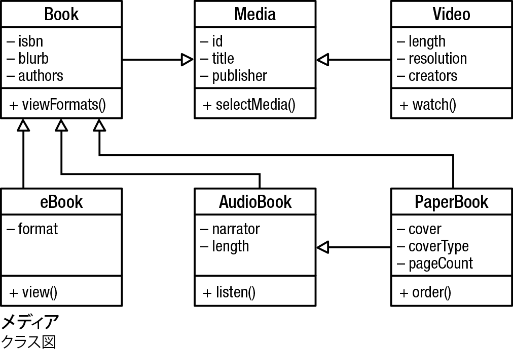
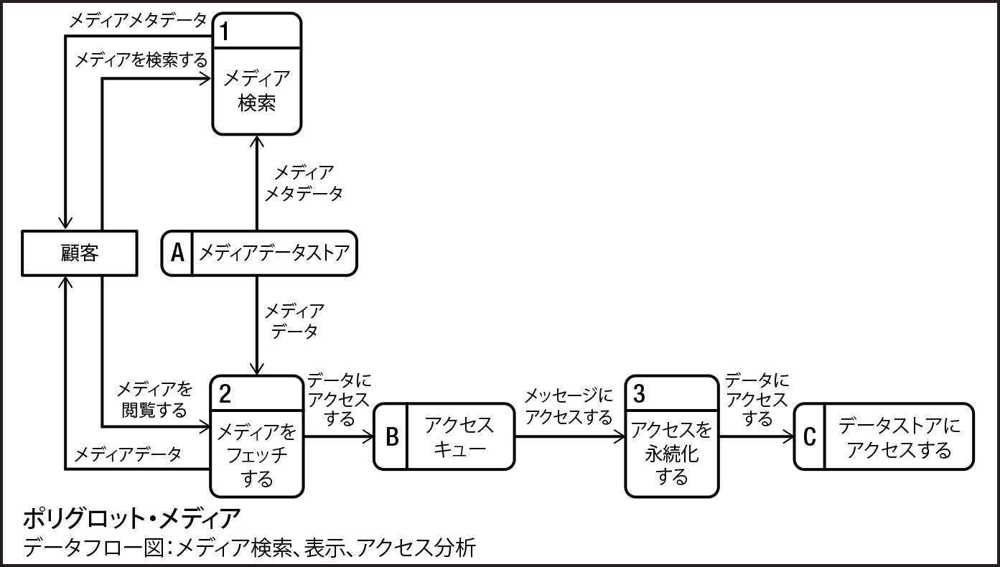

# 画像
[> ホーム](README.md)

> **Note**
当画像は[Figures](https://communicationpatternsbook.com/figures.html) にある [CC BY 4.0 (Jacqui Read / jacquiread.com)](https://creativecommons.org/licenses/by/4.0/) でライセンスされた画像を翻訳して作成したものです。

## コンテンツ
### 第I部
- <a href="#chap01">1章</a>
- <a href="#chap02">2章</a>
- <a href="#chap03">3章</a>
- <a href="#chap04">4章</a>
- <a href="#chap05">5章</a>
- <a href="#chap06">6章</a>

### 第II部
- <a href="#chap07">7章</a>
- <a href="#chap08">8章</a>
- <a href="#chap09">9章</a>

### 第III部
- <a href="#chap10">10章</a>
- <a href="#chap11">11章</a>
- <a href="#chap12">12章</a>

### 第IV部
- <a href="#chap13">13章</a>
- <a href="#chap14">14章</a>
- <a href="#chap15">15章</a>

## 1章

### 図1-1

### 図1-2

### 図1-3

### 図1-4

### 図1-5

### 図1-6

### 図1-7

### 図1-8

### 図1-9

### 図1-10

### 図1-11

### 図1-12

<a href="#toc">^ contents</a>

## 2章
### 図2-1

### 図2-2

### 図2-3

### 図2-4

### 図2-5

### 図2-6

### 図2-7

### 図2-8

<a href="#toc">^ contents</a>

## 3章
### 図3-1

### 図3-2

### 図3-3

### 図3-4

### 図3-5

### 図3-6

### 図3-7

### 図3-8

<a href="#toc">^ contents</a>

## 4章
### 図4-1

### 図4-2

### 図4-3

### 図4-4

### 図4-5

### 図4-6

### 図4-7

### 図4-8

### 図4-9

<a href="#toc">^ contents</a>

## 5章
### 図5-1

### 図5-2

### 図5-3

### 図5-4

### 図5-5

### 図5-6

### 図5-7

### 図5-8

### 図5-9

<a href="#toc">^ contents</a>

## 6章
### 図6-1

### 図6-2

### 図6-3

### 図6-4

### 図6-5

### 図6-6

### 図6-7

### 図6-8

### 図6-9

### 図6-10

### 図6-11

### 図6-12

### 図6-13

### 図6-14

### 図6-15

### 図6-16

### 図6-17

<a href="#toc">^ contents</a>

## 7章
### 図7-1

<a href="#toc">^ contents</a>

## 8章
### 図8-1

### 図8-2

<a href="#toc">^ contents</a>

## 9章
### 図9-1

<a href="#toc">^ contents</a>

## 10章
### 図10-1

### 図10-2

### 図10-3

### 図10-4

### 図10-5

<a href="#toc">^ contents</a>

## 11章
### 図11-1

### 図11-2

<a href="#toc">^ contents</a>

## 12章
### 図12-1

### 図12-2

### 図12-3
[陜zview text version](/assets/ADR-example-decision-making.md)

### 図12-4
[陜zview text version](/assets/ADR-example-decision-making.md)

### 図12-5
[陜zview text version](/assets/ADR-example.md)

### 図12-6

### 図12-7

<a href="#toc">^ contents</a>

## 13章
### 図13-1

### 図13-2

<a href="#toc">^ contents</a>

## 14章
### 図14-1

<a href="#toc">^ contents</a>

## 15章
### 図15-1

### 図15-2

### 図15-3

### 図15-4

<a href="#toc">^ コンテンツ</a>

[> ホーム](README.md)
